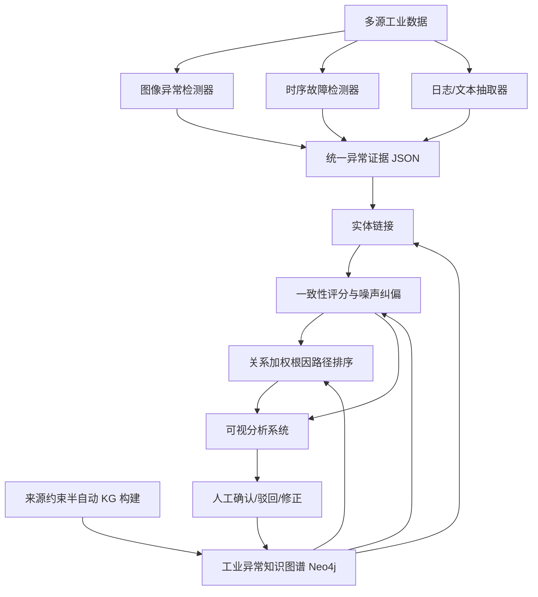
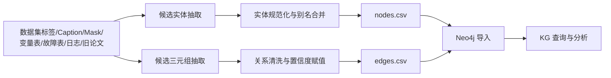
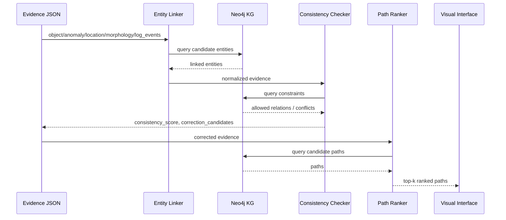

# 论文思路详述（动态草案）

> **状态说明**：本文档为当前阶段的论文思路草案，用于组会讨论、任务拆分和 Git 项目开发对齐。文档内容会随着数据集可用性、实验结果、导师反馈和系统实现进展持续调整，不代表最终论文定稿。

---

## 1. 研究背景与问题定义

工业场景中的异常检测与缺陷诊断通常面临多源异构、高噪声和可解释性不足的问题。实际生产过程中，异常证据可能来自多种来源，例如工业图像、传感器时序、设备日志、检修记录、工艺规则和专家经验等。这些数据在模态、格式、语义粒度和可靠性上均存在显著差异。

现有异常检测方法通常侧重于单一模态的检测性能，例如图像异常检测关注异常分数与像素级定位，过程工业故障诊断关注传感器变量偏移和故障分类，晶圆缺陷分析关注缺陷类型识别与机台日志排查。然而，在真实工业应用中，仅给出“是否异常”或“异常区域”往往不足以支持工程人员进行决策。工程人员更关心的问题包括：

1. 异常证据来自哪里？
2. 这些证据是否可信，是否存在噪声或语义冲突？
3. 异常可能对应哪些缺陷类型、故障事件或工艺问题？
4. 系统能否给出可解释的候选原因路径？
5. 工程人员能否在系统中检查、修正和反馈这些推理结果？

因此，本研究拟构建一套面向多源异构工业异常场景的知识增强可视分析 pipeline，将不同模态下的异常检测结果统一转化为结构化异常证据，并结合知识图谱完成证据规范化、一致性评分、噪声纠偏和根因路径排序，最终形成支持人在回路分析的可视化系统原型。

---

## 2. 研究目标

本研究的总体目标是：

> 构建一个面向工业异常检测与原因溯源的知识增强可视分析系统，将图像、时序、日志和文本描述等多源异常证据统一表示为标准化 JSON 对象，并通过来源约束的半自动知识图谱构建、知识一致性评分、证据纠偏和关系加权路径排序，实现高噪声条件下的异常解释与候选根因分析。

具体目标包括：

1. **统一异常证据表示**：设计统一的 anomaly evidence JSON schema，将图像异常区域、文本 caption、过程变量、机台日志等异构输出转化为可统一处理的结构化证据对象。
2. **来源约束的半自动知识图谱构建**：从数据集标签、caption、mask、变量表、故障表、旧项目知识、日志事件和领域文本中抽取候选实体与三元组，并为每条关系保留 source、evidence、confidence 和 review_status。
3. **知识约束的证据一致性评分与纠偏**：利用 KG 中的实体、属性和关系约束，对异常证据中的类型、位置、形态、变量和日志字段进行一致性检查，识别可能的噪声字段，并生成候选纠偏结果。
4. **关系加权根因路径排序**：在 KG 中从异常实体出发搜索候选原因路径，并综合关系置信度、证据匹配程度和路径长度惩罚进行排序，输出 top-k 候选溯源路径。
5. **人在回路的可视分析系统原型**：构建可视化界面，支持异常证据查看、冲突字段高亮、纠偏建议比较、候选路径对比、what-if 分析和人工反馈。

---

## 3. 整体技术路线

系统整体采用“检测器解耦、证据统一、KG 增强、路径排序、可视反馈”的设计思想。底层异常检测器根据不同数据类型分别选择成熟方法；系统核心贡献集中在统一证据表示、KG 构建、证据纠偏和可视溯源。



---

## 4. 数据集与 use case 设计

本研究暂定围绕三个 use case 展开。三个 use case 不要求使用同一个异常检测模型，而是共享统一的证据表示、KG 分析和可视溯源框架。

### 4.1 DS-MVTec / Defect Spectrum：视觉缺陷语义证据与噪声纠偏

该 use case 用于验证图像、caption 和 mask 共同支持下的异常证据抽取与高噪声证据纠偏能力。

主要输入包括工业图像、缺陷 caption、细粒度 mask、缺陷类型或语义标签。

主要任务包括：

1. 从 caption 中抽取 anomaly_type、location、morphology 等字段；
2. 从 mask 中提取缺陷位置、形态和严重度；
3. 构造 clean evidence；
4. 注入字段级噪声；
5. 利用 KG 判断 caption、mask 与缺陷语义之间是否一致；
6. 输出纠偏候选。

该 use case 不承担真实工艺根因验证，而是用于验证视觉异常证据的语义规范化与高噪声纠偏。

### 4.2 Tennessee Eastman Process：过程时序异常与故障诊断

该 use case 用于验证多变量过程时序下的异常变量提取、变量到工艺单元映射和候选故障路径排序能力。

主要输入包括多变量时序窗口、异常检测分数、异常变量及贡献度、故障类型标签或预测结果。

主要任务包括：

1. 识别异常变量；
2. 将变量映射到过程单元；
3. 将变量组合映射到候选故障类型；
4. 在 TEP 子图中搜索故障原因路径；
5. 输出 top-k 过程故障解释。

### 4.3 晶圆数据集：图像 + 日志 + 工艺 KG 的完整溯源闭环

该 use case 是完整溯源闭环的核心展示场景。

主要输入包括晶圆颗粒图、缺陷分类结果、机台日志、工艺报警事件、旧项目中的湿法工艺 KG 或可抽取文本。

主要任务包括：

1. 识别晶圆缺陷类型；
2. 从机台日志中抽取异常事件；
3. 将日志事件链接到 KG；
4. 检查缺陷类型与日志证据是否一致；
5. 搜索并排序候选根因路径；
6. 通过可视化界面支持工程人员确认或驳回。

---

## 5. 统一异常证据 JSON Schema

不同模态的检测结果最终都需要转换为统一的 JSON 结构。该结构既用于脚本实验，也用于后续可视化系统。

```json
{
  "case_id": "string",
  "dataset": "ds_mvtec | tep | wafer",
  "source": "image | time_series | log | multimodal",
  "object": "string",
  "anomaly_type": "string",
  "location": "string | null",
  "morphology": "string | null",
  "severity": 0.0,
  "confidence": 0.0,
  "timestamp": "string | null",
  "raw_evidence": {
    "image_region": "string | null",
    "heatmap_path": "string | null",
    "variables": [],
    "variable_contributions": {},
    "log_events": [],
    "description": "string"
  },
  "normalized_evidence": {
    "object": "string | null",
    "anomaly_type": "string | null",
    "location": "string | null",
    "morphology": "string | null",
    "process_unit": "string | null",
    "fault_type": "string | null"
  },
  "kg_analysis": {
    "linked_entities": {},
    "consistency_score": 0.0,
    "inconsistent_fields": [],
    "correction_candidates": [],
    "top_k_paths": []
  },
  "human_feedback": {
    "accepted_corrections": [],
    "rejected_corrections": [],
    "accepted_paths": [],
    "rejected_paths": [],
    "edited_fields": {},
    "comments": "",
    "reviewer_role": "",
    "timestamp": ""
  }
}
```

该 schema 的作用包括：

1. 统一异构异常检测输出；
2. 为 KG 实体链接提供输入；
3. 为一致性评分和纠偏提供字段级对象；
4. 为可视化界面提供稳定数据结构；
5. 为人工反馈预留接口。

---

## 6. Source-Constrained Semi-Automatic KG Construction

由于项目开发者并非工业领域专家，且时间有限，本研究不采用完全人工建图方式，而采用来源约束的半自动知识图谱构建流程。

### 6.1 基本原则

1. KG 是 task-oriented KG，不追求百科式完备；
2. 所有三元组必须来自明确来源；
3. LLM 或自动脚本只能生成候选三元组，不能直接视为真值；
4. 每条边必须包含 source、evidence、confidence 和 review_status；
5. 只有能服务证据规范化、一致性检查、纠偏候选生成或路径排序的知识才进入 v0 KG。

### 6.2 KG 构建流程



### 6.3 节点表设计

```csv
id,name_en,name_zh,label,scenario,aliases_en,aliases_zh,description,source
ScratchDefect,Scratch Defect,划痕缺陷,AnomalyType,mvtec,"scratch|line defect|scratch mark","划痕|刮痕|线状缺陷",Line-shaped surface defect,manual
NearfullDefect,Nearfull Defect,几乎全满缺陷,AnomalyType,wafer,"nearfull|dense particles|full wafer contamination","几乎全满|满片污染|大面积颗粒",Dense particle defect,wafer_thesis
```

### 6.4 边表设计

```csv
head,relation,tail,scenario,source,evidence,confidence,weight,review_status
ScratchDefect,HAS_MORPHOLOGY,LineShape,mvtec,caption_mask_stats,"scratch captions and elongated masks",0.90,0.10,auto
GlueRemovalInsufficient,CAUSES,NearfullDefect,wafer,wafer_thesis,"insufficient glue removal may cause nearfull defect",0.88,0.12,reviewed
```

其中：

\[
weight = 1 - confidence
\]

在 v0 阶段，KG 的规模应控制在 300–600 条三元组左右，以保证能够快速跑通系统闭环。

---

## 7. KG 与 JSON 的协同方式

KG 不直接处理原始图像、时序或日志，而是处理转换后的 evidence JSON。系统运行时，JSON 中的字段会被链接到 KG 节点，随后进行一致性检查、纠偏候选生成和路径搜索。



---

## 8. 知识约束证据一致性评分与纠偏

设一条异常证据为 \(e\)，其包含实体字段、属性字段和关系字段。系统将 \(e\) 映射到 KG 后，计算其与 KG 的一致性分数：

\[
S(e)=\lambda_1 S_{entity}(e)+\lambda_2 S_{attribute}(e)+\lambda_3 S_{relation}(e)
\]

其中：

- \(S_{entity}(e)\)：证据字段能否成功链接到 KG 实体；
- \(S_{attribute}(e)\)：缺陷类型与位置、形态等属性是否一致；
- \(S_{relation}(e)\)：不同证据字段之间是否满足 KG 关系约束；
- \(\lambda_1,\lambda_2,\lambda_3\)：权重参数。

当 \(S(e)\) 低于阈值时，系统标记该证据存在潜在噪声，并根据 KG 邻域生成纠偏候选：

\[
Correction(c)=sim(c,e)+\eta \cdot Consistency(c,KG)
\]

其中：

- \(sim(c,e)\)：候选实体与当前证据的文本或语义相似度；
- \(Consistency(c,KG)\)：候选替换后与 KG 的一致性；
- \(\eta\)：一致性权重。

该模块的输出包括：

```json
{
  "consistency_score": 0.42,
  "inconsistent_fields": ["anomaly_type", "morphology"],
  "correction_candidates": [
    {
      "field": "anomaly_type",
      "original": "scratch",
      "suggested": "crack",
      "confidence": 0.82
    }
  ]
}
```

---

## 9. 关系加权根因路径排序

对于已经规范化的异常证据，系统从异常实体出发，在 KG 中搜索到候选根因节点的路径。候选路径 \(P\) 的排序分数定义为：

\[
Score(P)=\alpha \cdot Conf(P)+\beta \cdot EvidenceMatch(P)-\gamma \cdot Length(P)
\]

其中：

- \(Conf(P)\)：路径上关系置信度的均值或加权平均；
- \(EvidenceMatch(P)\)：路径节点与当前 evidence JSON 中证据字段的匹配程度；
- \(Length(P)\)：路径长度；
- \(\alpha,\beta,\gamma\)：路径排序权重。

系统最终输出 top-k 候选路径。例如：

```text
NMPOriginalBarrelLowLevel
→ NMPSupplyInsufficient
→ NMPPressureTankLowLevelAlarm
→ HighPressureNMPFlowAlarm
→ GlueRemovalInsufficient
→ NearfullDefect
```

---

## 10. 噪声建模与实验设计

本文中的噪声不局限于图像噪声，而是指异常证据在多模态抽取、命名、描述、对齐和融合过程中产生的字段级语义噪声。

常见噪声包括：

| 噪声类型 | 示例 |
|---|---|
| 缺陷类型错误 | crack 被写成 scratch |
| 位置错误 | edge 被写成 center |
| 形态错误 | line-shaped 被写成 circular |
| 文本模糊 | “something wrong on the surface” |
| 字段缺失 | 缺少 location 或 log_event |
| 同义词混用 | nearfull / full contamination / dense particles |
| 变量名混乱 | XMEAS_7 / reactor pressure |
| 日志事件错配 | NMP flow alarm 与无关报警混入 |

实验中可设置不同噪声比例：

\[
r \in \{0.1,0.2,0.3,0.4,0.5\}
\]

并比较以下方法：

1. 无 KG；
2. KG lookup；
3. KG consistency scoring；
4. KG consistency scoring + correction；
5. 完整 pipeline。

---

## 11. 系统与人在回路设计

系统最终目标不是只输出实验指标，而是支持工程人员在界面中查看、理解、验证和修正异常分析结果。

### 11.1 用户任务

| 编号 | 任务 |
|---|---|
| T1 | 查看异常样本及其证据来源 |
| T2 | 判断异常证据是否存在语义冲突 |
| T3 | 查看 KG 推荐的纠偏候选 |
| T4 | 比较 top-k 候选根因路径 |
| T5 | 修改证据字段并进行 what-if 分析 |
| T6 | 接受或驳回系统推荐结果 |
| T7 | 将人工反馈用于更新 KG 关系置信度 |

### 11.2 反馈结构

```json
{
  "feedback_type": "path",
  "case_id": "wafer_037222",
  "path_id": "path_001",
  "decision": "accept",
  "user_comment": "This path matches the observed NMP alarm sequence."
}
```

### 11.3 反馈更新

在 v0 阶段，采用轻量级反馈更新策略：

\[
conf_{new}=clip(conf_{old}+\Delta)
\]

其中：

- 用户接受路径或关系时，\(\Delta > 0\)；
- 用户拒绝路径或关系时，\(\Delta < 0\)。

该机制不声称为复杂在线学习，而是作为可视分析系统中的 human-in-the-loop 反馈闭环。

---

## 12. 评价指标

### 12.1 Evidence 转换指标

- Schema validity rate；
- Field completion rate；
- Caption-to-JSON field accuracy；
- Mask-derived location / morphology accuracy。

### 12.2 KG 实体链接指标

\[
EntityLinkingAccuracy=\frac{\#CorrectLinkedEntities}{\#AllLinkedEntities}
\]

同时统计：

- Top-k linking accuracy；
- Linking coverage；
- Ambiguity rate。

### 12.3 噪声检测与纠偏指标

- Inconsistency detection precision；
- Inconsistency detection recall；
- Correction accuracy；
- Top-k correction accuracy；
- Noise recovery rate；
- False correction rate。

### 12.4 路径排序指标

- Top-1 root-cause accuracy；
- Top-3 root-cause accuracy；
- MRR；
- Path hit rate；
- Expert acceptance rate。

MRR 定义为：

\[
MRR=\frac{1}{N}\sum_{i=1}^{N}\frac{1}{rank_i}
\]

### 12.5 可视分析系统指标

- Task completion time；
- Root-cause identification accuracy；
- Interaction count；
- User confidence；
- Expert feedback。

---

## 13. 预期贡献

当前阶段的预期贡献包括：

1. **统一异常证据表示**：提出面向图像、时序、日志和文本描述的 anomaly evidence JSON schema。
2. **来源约束的半自动 KG 构建流程**：提出一种面向工业异常检测与溯源任务的 lightweight KG 构建流程，使每条知识边均可追溯来源、证据和置信度。
3. **知识约束的证据一致性评分与纠偏方法**：利用 KG 约束识别字段级噪声，并生成可解释纠偏候选。
4. **关系加权的根因路径排序方法**：在 KG 中搜索候选原因路径，并结合关系置信度、证据匹配度和路径长度进行排序。
5. **人在回路的可视分析系统原型**：支持工程人员查看异常证据、比较候选原因、进行 what-if 分析，并通过人工反馈修正系统结果。

---

## 14. 当前边界与注意事项

1. 本项目不追求统一底层异常检测模型，而是统一异常证据表示与 KG 分析流程。
2. MVTec / DS-MVTec 主要用于视觉语义证据和噪声纠偏，不用于真实工艺根因验证。
3. TEP 用于过程故障诊断和变量级故障解释。
4. 晶圆数据用于完整的图像-日志-KG 溯源闭环验证。
5. KG 是 task-oriented lightweight KG，不是全面工业百科知识库。
6. LLM 只能用于候选抽取或 caption adapter，不能作为工业因果知识的唯一依据。
7. 所有 KG 边必须保留 source、evidence、confidence 和 review_status。
8. 本文档为动态设计草案，后续可根据组会意见、实验结果和工程进展持续调整。

---

## 15. 当前开发优先级

建议开发顺序如下：

1. 建立 Git 工程与 uv 依赖管理；
2. 编写 evidence schema；
3. 准备 example JSON；
4. 设计 KG CSV schema；
5. 构建 v0 KG；
6. 完成 Neo4j Docker 与导入脚本；
7. 实现 entity linking；
8. 实现 consistency scoring；
9. 实现 correction candidate generation；
10. 实现 path ranking；
11. 实现 noise injection；
12. 实现 metrics；
13. 实现 Streamlit demo；
14. 准备 case study；
15. 根据组会反馈调整论文定位。

---

## 16. 总结

本项目拟从“异常检测结果不可解释、异常证据高噪声、多源信息难统一、根因分析依赖人工经验”的工业痛点出发，构建一条知识增强的工业异常检测与溯源 pipeline。项目以统一 anomaly evidence JSON 为中间层，以来源约束的半自动 KG 构建为知识基础，以一致性评分、噪声纠偏和路径排序为核心分析能力，并通过 human-in-the-loop 可视分析系统支持工程师完成证据检查、假设验证和根因判断。

当前设计仍处于动态阶段，后续将根据数据可用性、实验结果、系统实现难度和导师反馈进行持续调整。
